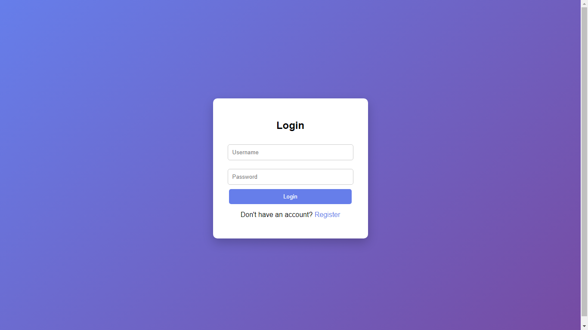

# login-js
# 🔐 Login Authentication System

A simple and beginner-friendly **Login Authentication System** built using **HTML, CSS, and JavaScript**.  
This project allows users to **register**, **login**, and **access a secured page**, with smooth **hover effects** for a better user experience.

---

## 🚀 Features

- ✅ User Registration
- ✅ User Login Authentication
- ✅ Secured Dashboard Page
- ✅ Logout Functionality
- 🎨 Attractive UI with Hover Effects
- 💾 Uses Browser `localStorage`
- 🧑‍💻 Beginner-Friendly Project

---

## 🛠️ Technologies Used

- **HTML5**
- **CSS3**
- **JavaScript (Vanilla JS)**

---
## 📁 Project Structure

login-auth-system/
│
├── index.html # Login page
├── register.html # Registration page
├── dashboard.html # Secured dashboard
├── style.css # Styling with hover effects
└── script.js # Authentication logic
---

## 📸 Project Screenshots

---

## 📁 Project Structure

